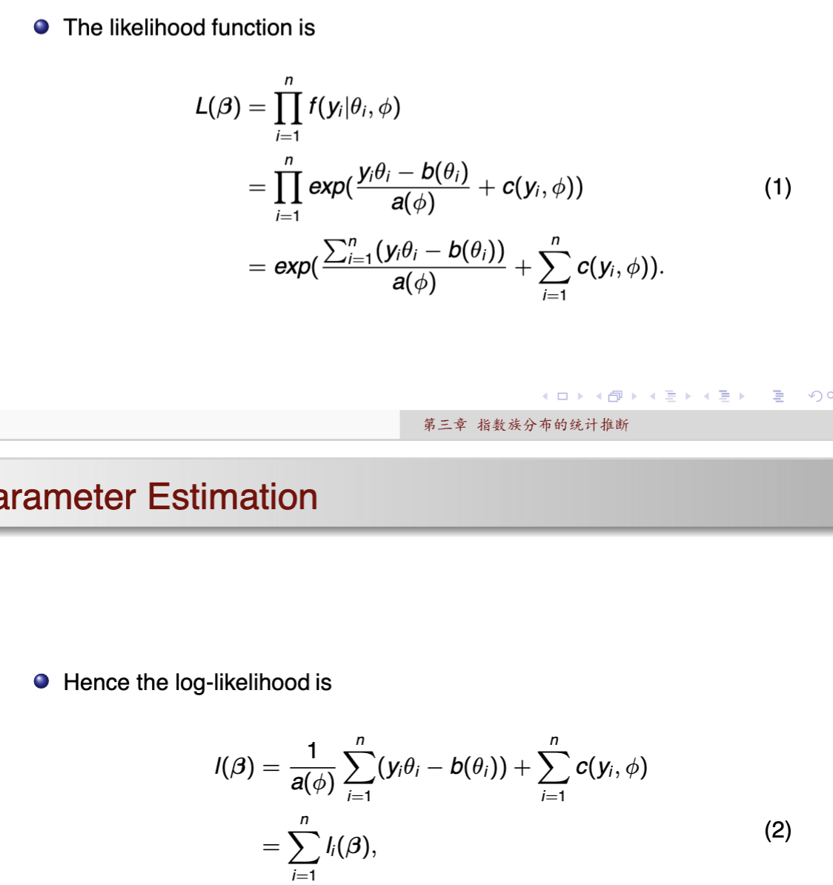
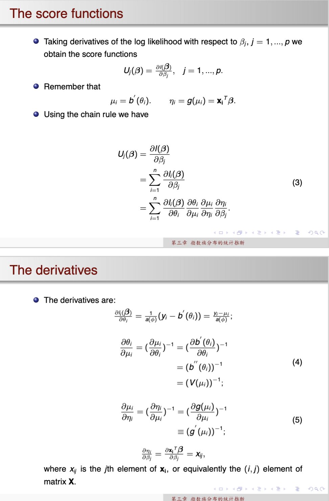
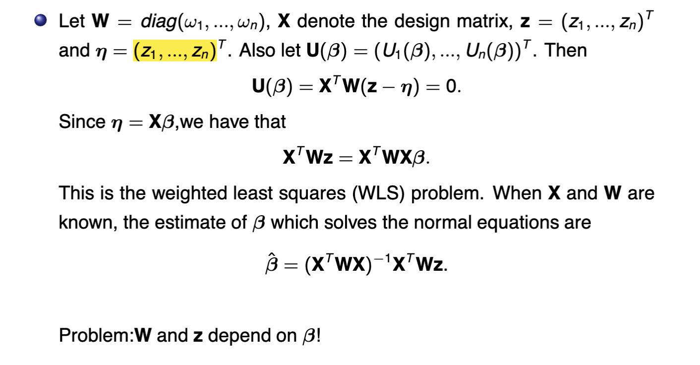
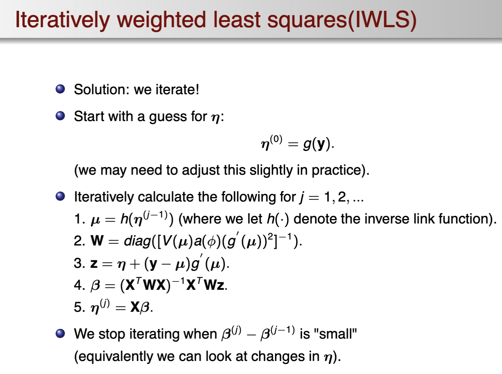

# GeneralizedLinearModel-Review

## 提纲

- 第一章 线性模型的统计推断
  - error structure
    - $\boldsymbol{Y} \mid \mathbf{X} \sim \boldsymbol{N}_{\mathrm{n}}\left(\boldsymbol{\mu}, \sigma^{2} \boldsymbol{I}_{\mathrm{n}}\right)$
  - systematic component
    - $\mu = E(Y|E) = X \beta$, where X is called design matrix
  - parameter estimation of beta
    - minimum the RSS(residual sum of squares)
    - get the least square estimate $\left(\mathbf{X}^{\mathrm{T}} \mathbf{X}\right) \hat{\boldsymbol{\beta}}=\mathbf{X}^{\mathrm{T}} \mathbf{y}$.
  - the rank of the design matrix
    - the least square estimate require design matrix being of column rank
    - if not, use generalized inverse, or using the iterative numeral method to calculate the numerial solution.
    - generalized inverse A*is to find the solution of A A* A = A
  - properties of the OLS estimate
    - moments equivalence, distribution
  - estimable functions
  - estimation of $\sigma^2$
- 第二章 广义线性模型的指数族分布
  - GLM组成
    - random component
    - link function
    - systematic predictor
  - 指数分布族简介与GLM联系
  - GLM setup(指数分布族经典写法,用 a、b、c)
    - 
    - 判断$\Phi$是否已知和固定：固定则为指数分布族
  - GLM退化为线性模型的情形(正态场景)
    - 
  - 目标标量的各种结果
    - Mean and Variance（如何得出，用似然函数+数学期望）
      - 
    - Likelihood function
      - 
    - derivative of log-likelihood
      - 
  - link function and canoical link
    - 
    - canonical 非奇异的
- 第三章 指数族分布的统计推断
  - 参数估计 $\beta$
    - 最大似然 
    - score function以及表达式变换
      - 
      - 
    - 使用加权最小二乘估计求解IWLS
      - 
    - 使用Fisher scoring（NR方法）
  - 代码实现：bin_simulation.py
  - evaluation: deviance, Likelihood ratio tests(LRTs), Pearson 卡方检验，residual plots, the working and anscomebe residuals.
- 第四章 二项分布的统计推断
  - 介绍二项伯努利实验的分布与近似
  - 用置信区间的例子解释map概率在[0,1]需要logit变化,eta与mu的关系,其实是现在构造置信区间都是两边区间宽度对称的方法
    - key idea: 构建一个eta的置信区间，再用logit函数映射到[0,1]上
  - link函数的常用选择
    - Logit: g1(p) = log(p/(1-p))
    - Probit: g2(p) = Phi-1(p)
    - C loglog: g3(p) = log(-log(1-p))
    - Log-log: g4(p) = - log(- log(p))
    - logit和probit在[0.1, 0.9]区间线性
    - 小p, Cloglog和logit相似
    - 大p, Loglog和logit相似
    - Cloglog的增长慢于其他函数
  - inverse link function
    - Logit: h1(eta) = exp(eta) / (1 + exp(eta))
    - Probit: h2(eta) = Phi(eta)
    - C loglog: h3(eta) = 1 - exp(-exp(eta))
    - Log-log: g4(p) = exp(- exp(eta))
  - 几率和几率比
  - 多模态
  - 交互作用

- 第五章 泊松分布的统计推断
  - 估计$\lambda$也有$y-1.96\sqrt{\lambda}$ 小于0的问题，使用log exp的变换进行映射。核心问题，使用大数定律来正态估计时要注意区间,尽量变换到[-inf,inf]的区间上。
  - 数据取值范围和本身的分布，拟合协变量的关系一定要考虑Y本身的特点

- 第六章 偏大离差的统计推断
  - 满足偏大离差的条件
  - 使用尺寸参数来控制偏大离差
  - deviance评估的调整（针对偏大离差）
  - 使用beta-binomial来控制偏大离差
- 第七章 伪似然估计及其统计推断
  - 有时候也很难判断我们的数据类型属于什么分布
  - QS: quasi-score的定义, $U = (Y- \mu)/\sigma^2 / V(\mu)$.
  - QL: quasi-likelihood, $Q = \int^\mu_Y \frac{Y - t }{ (\sigma^2*V(t))} $
  - QD: quasi-deviance, $D = - 2 \sigma^2 Q(\mu;y)$
  - 使用伪似然估计beta，利用IWLS迭代法

## 课堂代码练习

## 习题

- 第一章
  - 第一题 证明复合表达式概率分布间独立，构建正交矩阵 A
  - 第二题 证明表达式符合 F分布 卡方可加性
- 第四章
  - 思考题1：对二项分布构建置信区间
  - 实际数据：随机抽查平时有喝咖啡习惯的人
  - 思考题2：X，Y都为二分类变量，比较列联表分析的卡方检验和logistic的系数beta检验（似然比检验）
