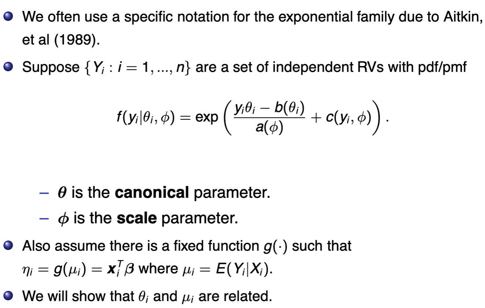
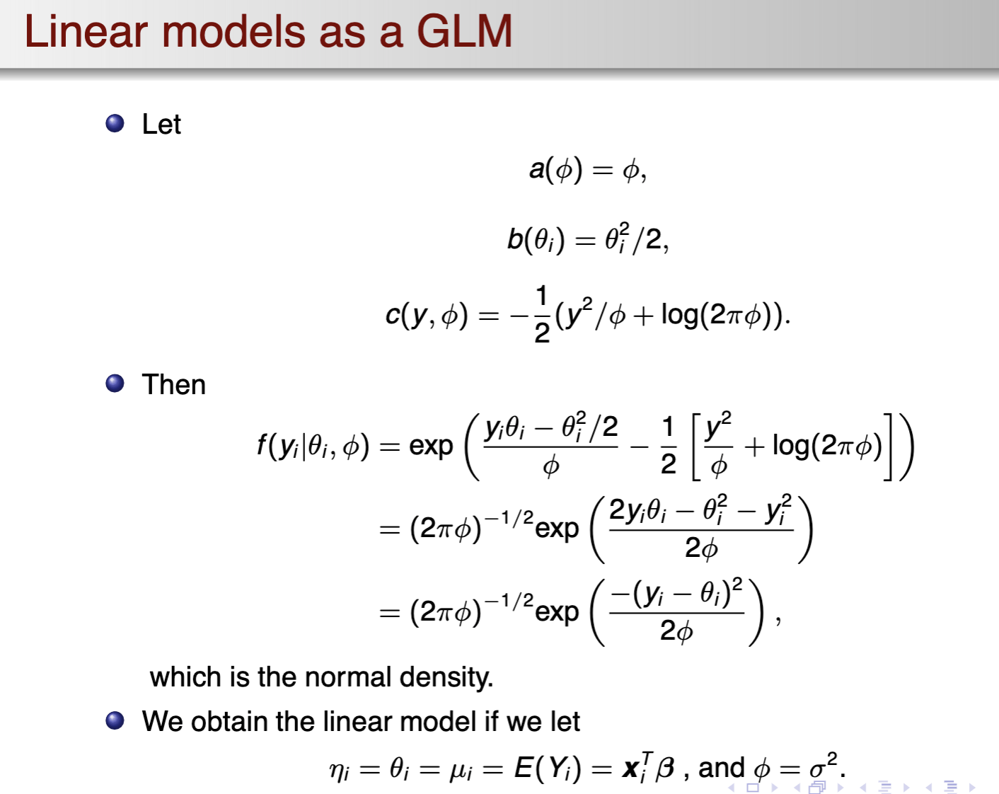
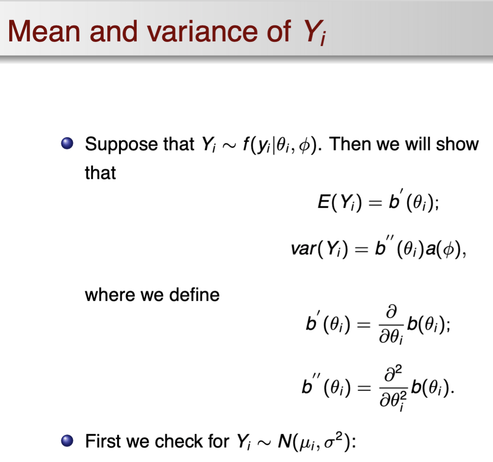
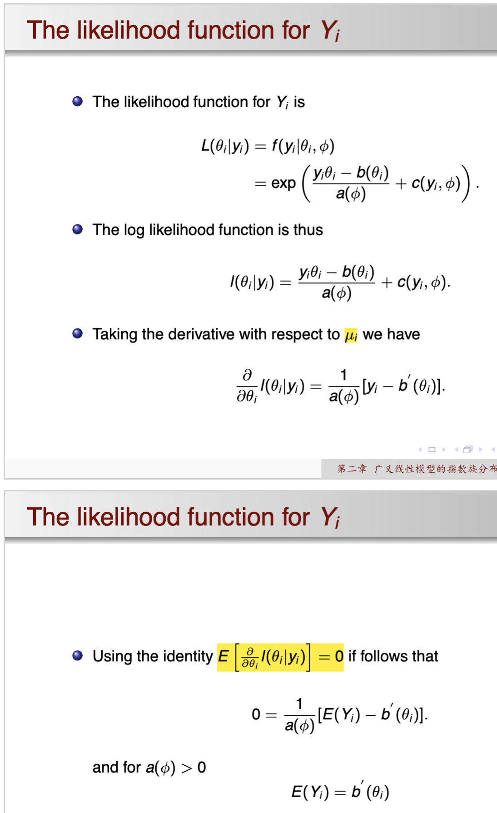
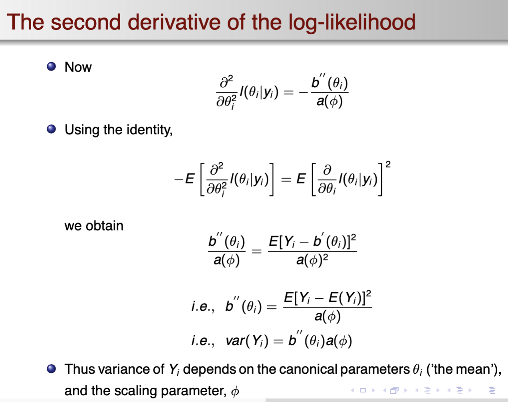
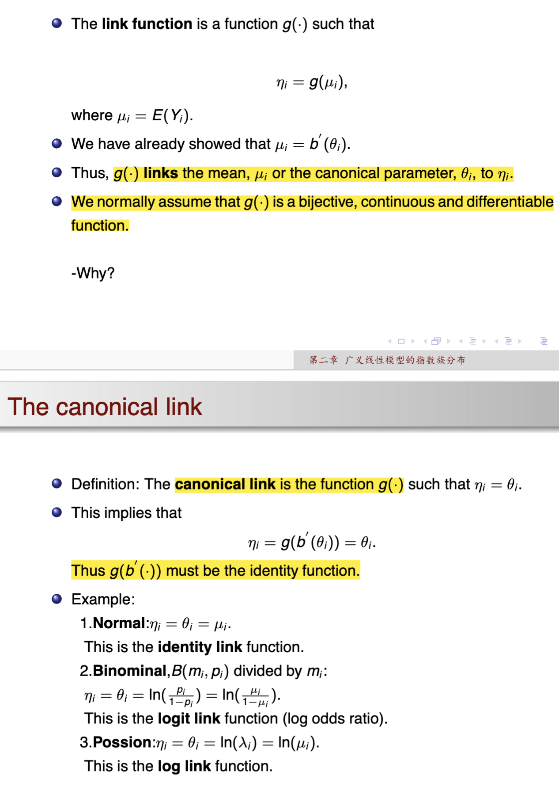

# GeneralizedLinearModel-Review

## 提纲

- 第一章 线性模型的统计推断
  - error structure
  - systematic component
  - parameter estimation of beta
  - the rank of the design matrix
  - properties of the OLS estimate
    - moments equivalence, distribution
  - estimable functions
  - estimation of $sigma^2$
- 第二章 广义线性模型的指数族分布
  - GLM组成
    - random component
    - link function
    - systematic predictor
  - 指数分布族简介与GLM联系
  - GLM setup
    - 
    - 判断$\Phi$是否已知和固定：固定则为指数分布族
  - GLM退化为线性模型的情形
    - 
  - 目标标量$Y$的各种结果
    - Mean and Variance
      - 
    - Likelihood function
      - 
    - derivative of log-likelihood
      - 
  - link function and canoical link
    - 
- 第三章 指数族分布的统计推断
- 第四章 二项分布的统计推断
- 第五章 泊松分布的统计推断
- 第六章 偏大离差的统计推断
- 第七章 伪似然估计及其统计推断

## 课堂代码练习

## 习题
